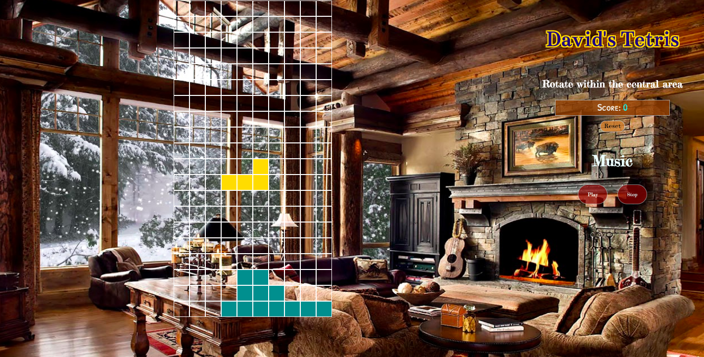
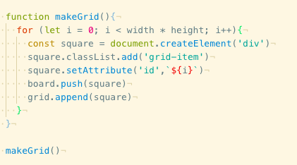
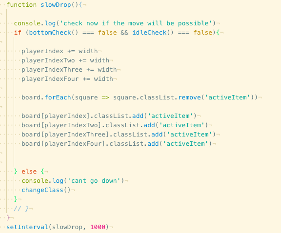
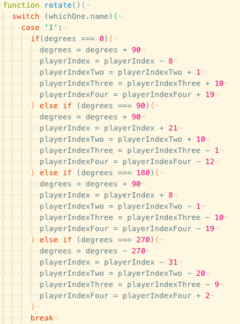
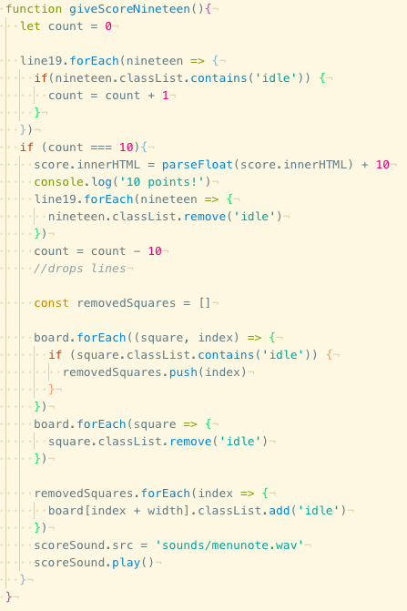
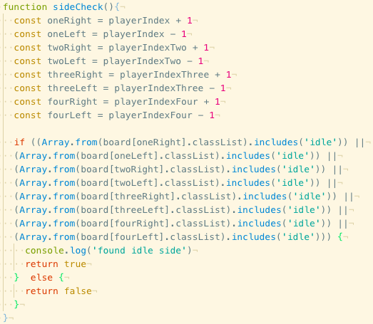
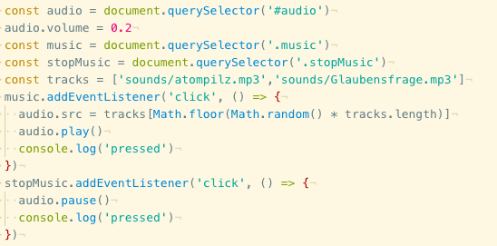

# Project 1: Tetris -Vanilla JS Web Game

1 week long personal project using only html, css and vanilla javascript.

I picked Tetris as I've always been a fan of the sandbox type of games with randomised outcomes.

## Theme

The theme is specifically inspired by an instrumental album I've been listening to. There are songs on the music player that provides the ambiance for this background of a luxurious, warm safe haven from the wintry cold outside. Overall I wanted to create a relaxing atmosphere for this game, I'd like to think the music is integral to the theme.

## Controls

Left, down and right arrow keys for movement.
Up arrow for blocks rotation.

Game starts automatically.
Reset button will clear the board and reset the score.

Play button will start a random song.
Stop button will stop the music.

## Javascript Overview

###### Grid

First I have to create a working grid for the game to be based on. Using a for loop to keep creating squares until the maximum number determined by height times width. The squares are given a grid-item class and then pushed onto the board array. Finally it's appended onto the grid.

###### Shape

The starting positions of the shapes are created by assigning numbers on the board to them. They receive an active class to their starting positions and all four of the blocks drop their position every second. Since the board width is 10, this is simply adding 10 to the number.

To rotate the shapes I set a new 'degrees' variable that switches numbers when set specifically for their shape.

###### Give Score/line manipulation

 When the shapes reach the bottom they will change to a class called 'idle'. When each line is filled completely, 10 points will be added to the scoreboard with a soothing sound effect, as well as dropping all the 'idle' lines above down one line. Due to the different circumstances for each line clear I have to create a seperate function for each. If any the shapes reach another 'idle' block they will be stopped and have their class switched to idle right away.

To make sure the shapes don't physically pass through idle blocks I created a function to check for the 'idle' class on the sides.

###### Music Section

I added two mp3 tracks that I feel compliment the feel of the design well. They are linked to the buttons as well as the audio tag on the html.

